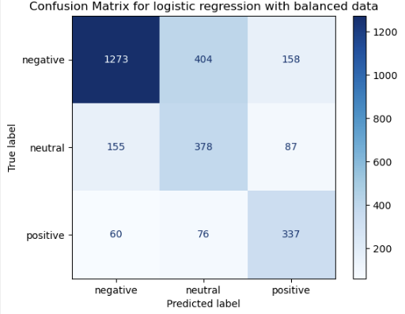

# Tweet-Sentiment-Classifier

This project applies Natural Language Processing and Machine Learning techniques to classify the sentiment of tweets into one of three classes: Positive, Negative, or Neutral. It also explores methods for handling imbalanced datasets and investigates the impact of replacing words with their synonyms.

## Setup

1) Download the project to your system. 
2) Upload "glove.6B.100d.txt" file to the main folder where your files (specifically sentiment_classifier.ipynb) are stored (not "data/" folder).
3) Open terminal in the project directory and install dependencies via ``` pip install -r requirements.txt ``` , if this does not work try providing a full path to the requirements file.
4) Open  **sentiment_classifier.ipynb** file.
5) Run each cell.

## Preprocessing

### Tokenization and formatting
Before vectorization, the text undergoes tokenization and formatting processes to improve performance. Therefore, the tweets are converted to lowercase, unnecessary parts (stop words, links, and mentions) are removed, and they are tokenized (split into individual words).

### Vectorization
Vectorization is conducted with the help of GloVe embeddings. Each token from a sentence is checked with keys in the GloVe dictionary and if a match is found it is assigned to a 100-dimensional vector. As part of the experiment, if a token does not match with any words within the dictionary it is replaced by one of its synonyms. 

**Note** : If a tweet is empty the vector is filled with 0s. If a word and its synonym do not have a match they are skipped.

## Models used

### Models used for training

For the project, it was decided to use two popular models:

- Logistic regression
- Naive Bayes (Gaussian)

The setup of the models is explained in the code. In addition, hyperparameters for the logistic regression model were tuned by **RandomizedSearchCV** from scikit-learn.

### Data balancing

The provided datasets are noticeably imbalanced. As a solution to this, I applied a SMOTE technique to oversample the datasets with similar values. Therefore the notebook consists of two parts with the tests on both balanced and imbalanced datasets.

## Results sections

### Metrics

Each cell where a model is used for prediction provides an overview of the results. The results include:

- Accuracy
- Precision
- Recall
- f1-score

### Confusion matrices

The confusion matrices are provided for testing each model. They help with the interpretation of the results and review of misclassifications. The matrices will look like this:



### Experiment

The code also includes a part with the experiment where the words not mentioned in the GloVe embedding are replaced with their synonyms.

## Comments and Notes

You can see the comments, markdowns, and notes throughout the notebook. It is important to read them to understand the decisions that were taken and how the dataset was analyzed/commented on
